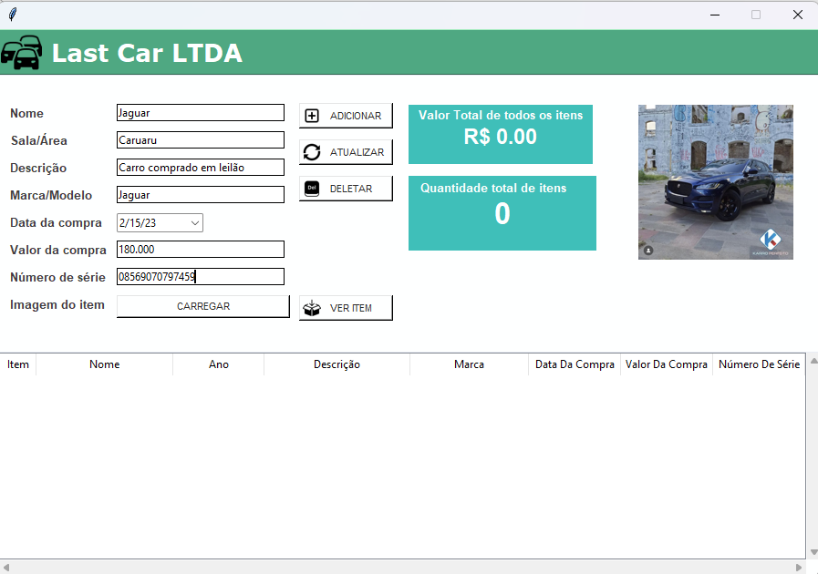

# Bem-vindos a mais um projeto! 

### Irei contar um pouco sobre cada passo do mesmo, e aqui farei uma sobre definição do que será usado/aprendido: 

# Sobre o projeto 

O projeto foi criado puramente com python, usando a biblioteca Tinker para interfaace, botões, cores e etc. O pprojeto é ligado ao bando de dados SQLite3 já pré estabelicido no python
como banco de dados principal. o projeto é simples, mas com as funcionalidades mais necessárias em uma aplicação que é o CRUD. 

## Layout 

- Tela Principal 

- Adicionar itens na tabela 

- Itens adicionados com sucesso 

- Erro - Preencha todos os campos 

- Lista de Itens 

